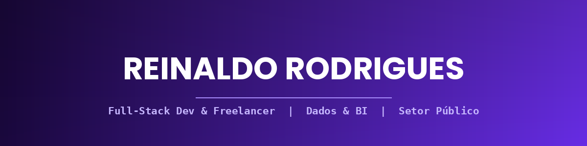

<div align="center">




</div>

## ⚡ REINALDO_AI_CORE

```
> REINALDO_SYSTEM v2.0
> Initializing system...
[████████████████████████████████████████] 100%

✔ Developer detected
✔ Curiosidade: enabled
✔ Code engine: activated
✔ Projects: loaded (11+)

STATUS: ONLINE 🟣
```

## 👋 About Me

```js
const reinaldo = {
  name: "Reinaldo Rodrigues",
  alias: "Reynas",
  role: "Desenvolvedor e Analista de Dados",
  location: "Pernambuco, Brasil 🇧🇷",
  languages: { "pt-BR": "nativo", "en": "básico" },

  summary:
    "Desenvolvedor e analista de dados com experiência em automação de " +
    "processos, raspagem e coleta de dados, pipelines de dados e " +
    "desenvolvimento de sistemas completos, APIs e aplicações web. Atuo " +
    "na área de tecnologia do setor público, produzindo soluções de " +
    "Business Intelligence com Power BI e Power BI Report Server para " +
    "órgãos do Governo de Pernambuco.",

  currently: [
    "Estagiário de Dados na ATI-PE — Agência Estadual de Tecnologia da Informação (out/2025–atual)",
    "Estudante de Sistemas de Informação, UNINASSAU (2023–2026)",
    "Freelancer em desenvolvimento web e automação de processos",
  ],

  alsoInto: ["ciência de dados", "inteligência artificial", "QA", "segurança da informação"],
  funFact: "Construindo um assistente de IA controlado por gestos de mão 🖐️✨",
};
```

## 🛠️ Tech Stack

<div align="center">


</div>

<!-- troque/adicione ícones em https://skillicons.dev — edite a lista depois de "?i=" -->

**Linguagens:** Python · Java · JavaScript · TypeScript

**Desenvolvimento Web:** HTML · CSS · Python Web (Flask, FastAPI, Streamlit) · PHP

**Mobile:** React Native (Expo)

**Back-end & APIs:** Node.js · Express.js · FastAPI · Flask · REST APIs

**Banco de Dados:** MySQL · MongoDB

**Business Intelligence:** Power BI Desktop · Power BI Report Server (PBIRS) · Report Builder · DAX · Power Query M

**Dados & Automação:** Pandas · OpenPyXL · web scraping (Playwright, BeautifulSoup) · OCR (Tesseract) · pipelines de dados · ETL · extração de PDFs (pdfplumber) · geração de relatórios Excel/PDF (Jinja2, xhtml2pdf, ReportLab)

**Inteligência Artificial:** LLMs (Groq / Llama 3) · LangChain · Ollama · LocalAI · IA generativa · chatbots · automação com n8n

**Ferramentas de Desenvolvimento:** Docker · Postman · Git · PyInstaller · Playwright · VS Code

**Integrações & APIs:** ClickUp API · Redmine API · SMTP/IMAP institucional · Google APIs (Safe Browsing, Fact Check) · Sightengine

**Qualidade de Software (QA):** testes, homologação, Involves Eye3

**Segurança da Informação:** boas práticas OWASP · verificação de fake news e deepfakes · análise de documentos legais

**Produtividade & Gestão do Conhecimento:** Obsidian (Zettelkasten/PARA) · ClickUp · Redmine

**Também uso nos meus projetos pessoais:** MediaPipe (hand tracking) · TouchDesigner · OSC (python-osc) · OpenCV · CustomTkinter · PowerShell · Chrome Extensions (Manifest V3) · Vite · Supabase · Chart.js · Tailwind CSS

## 🚀 Featured Projects

### Pessoais / Open Source

| Projeto | Descrição | Stack |
|---|---|---|
| 🖐️ [Jarvis](https://github.com/Reinaldo-rNeto/Jarvis) | Assistente pessoal de IA com interface de holograma controlada por gestos de mão (webcam + hand tracking) | Python, MediaPipe, TouchDesigner, OSC |
| 💜 [Finlu](https://github.com/TacitoF/Finlu) | PWA de finanças pessoais (orçamentos, metas, importação CSV, sync na nuvem) — codesenvolvido com [@TacitoF](https://github.com/TacitoF) | HTML/CSS/JS, Chart.js, Supabase |

### Profissionais — ATI-PE (Governo de Pernambuco)

*Ferramentas internas em produção/desenvolvimento na Agência Estadual de Tecnologia da Informação — código proprietário do Governo de PE, sem repositório público.*

| Projeto | Descrição | Stack |
|---|---|---|
| 📧 AutoMail | App desktop para disparo em massa de e-mails, com roteamento automático institucional/externo | Python, CustomTkinter, smtplib |
| 🤖 Extrator de Dados IA | Extração estruturada de dados (PDF, imagem, URL) com LLM, OCR e web scraping, exportável em CSV/Excel | Python, Streamlit, Groq (Llama 3.3), Playwright |
| 📋 Extrator ClickUp | Extração completa de workspace ClickUp (tarefas, anexos, metadados) para PDF/Excel/BI | Python, CustomTkinter, ClickUp API |
| 🔄 RedmineHG / RedmineJKS | Importação ClickUp → Redmine e robô de relatórios automatizados (planilhas, PDFs executivos, e-mail agendado) | Python, Flask, Redmine API, xhtml2pdf |
| 📊 PBIRS Gestores | Dashboard Power BI para gestores setoriais, publicado no Power BI Report Server | Power BI Desktop, PBIRS |
| 🔐 PBIRS Manager | Extensão de navegador para gestão de permissões de usuários no Power BI Report Server via API REST | Chrome Extension (Manifest V3), REST API |
| ⚖️ Detetive | API que analisa termos de serviço em busca de cláusulas abusivas ou suspeitas | Python, FastAPI |
| 🛡️ Scanner | App + API de verificação de desinformação — links suspeitos, fake news e deepfakes | React Native (Expo), Node.js, Express |
| 🏛️ Hubbi | PWA hub mobile-first para aplicações web do Governo de Pernambuco | Vite, React, TypeScript |

## 💼 Experiência

**ATI-PE — Agência Estadual de Tecnologia da Informação** · Estagiário · out/2025 – atual
Automação de processos (disparo de e-mails, migração ClickUp ↔ Redmine, relatórios agendados), extração e coleta de dados com IA/OCR/web scraping, dashboards de BI no Power BI Report Server, sistemas web e APIs REST (incluindo app mobile de detecção de fake news/deepfakes), e segurança da informação com foco em boas práticas OWASP.

**Stringhini Varejo LTDA** · Homologador · ago/2024 – fev/2025
Testes de homologação de sistemas com a ferramenta Involves Eye3, verificando conformidade de funcionalidades, desempenho e usabilidade.

## 🎓 Formação

**Sistemas de Informação** — UNINASSAU (2023–2026)

**Cursos:** Microsoft Power BI Para Business Intelligence e Data Science · Fundamentos de Engenharia de Dados · Fundamentos de Data Science & Inteligência Artificial *(todos — Data Science Academy)*

## 🎯 Current Mission

```
> CURRENT_MISSION.log

[✔] Full-stack development (React, Node.js, Flask, FastAPI)
[✔] Business Intelligence (Power BI, PBIRS, DAX, Power Query)
[~] Inteligência Artificial aplicada (LLMs, LangChain, automação com n8n)
[~] Segurança da informação (OWASP, verificação de desinformação)

STATUS: Never stop learning 🚀
```

## 📊 GitHub Stats

<div align="center">


</div>

<div align="center">


</div>
